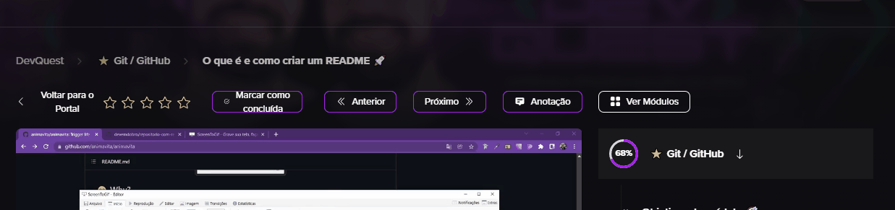

# Projeto com README
Um projeto de teste com um arquivo README ✨

[](https://pinterest.com)

## Tecnologias utilizadas
-HTML
-CSS
-JS

## Como utilizar 

1 - Clone para outro projeto
```
git clone <url>
```

2 - Clone para outro projeto
```
cd repositorio-com-readme
``` 
